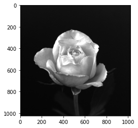
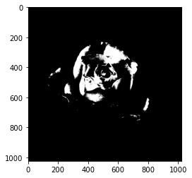
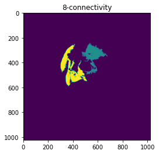

# Connected-component labeling

Detail : https://jstar0525.tistory.com/2

## Input image
</img>

## Thresholded binary image
</img>

## Connected-component labeling 
### using 4-connectivity and threshold 10,000 pixel
</img>

## Connected-component labeling 
### using 8-connectivity and threshold 10,000 pixel
</img>
