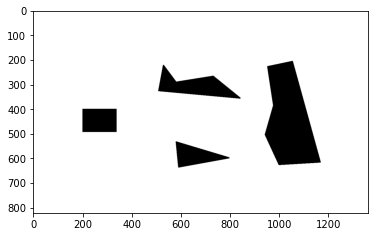
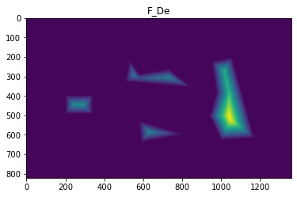

# Distance transform

Detail : https://jstar0525.tistory.com/3

## Input image
</img>

## Distance transform
### using Euclidean distance(De)
</img>

## Distance transform
### using City block distance(D4)
</img>

## Distance transform
### using Chessboard distance(D8)
</img>
