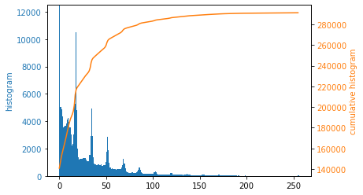
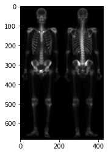
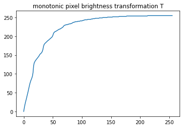
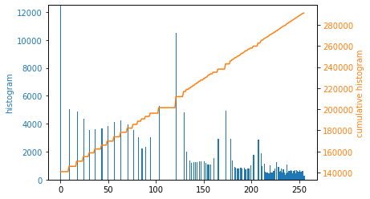
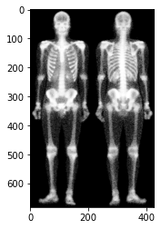
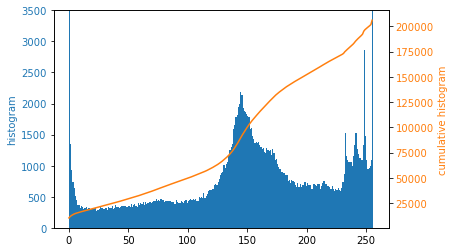
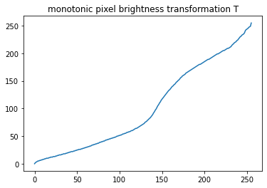
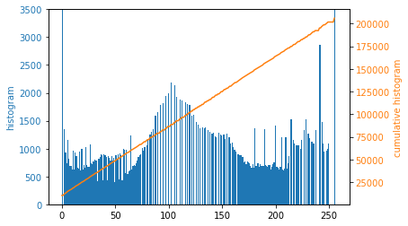
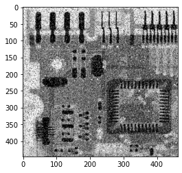

# Histogram equalization

## Input image
</img>
</img>

### monotonic pixel brightness transformation T
</img>

### Histogram equalization
</img>
</img>

## Input image
</img>
</img>

### monotonic pixel brightness transformation T
</img>

### Histogram equalization
</img>
</img>