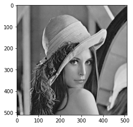
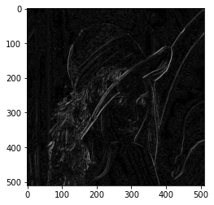
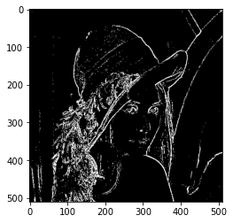
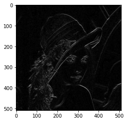
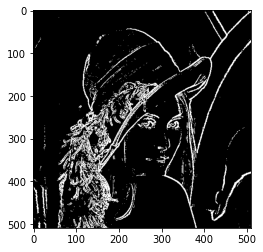
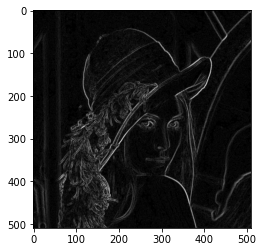
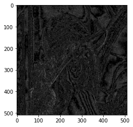
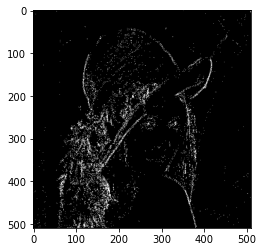
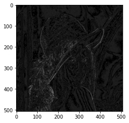
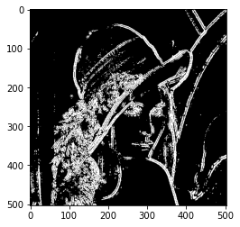

# Edge detection

## Input image
</img>

### Roberts operator
</img>
</img>
</img>
</img>

### Sobel operator
</img>
</img>
</img>
</img>

### Prewitt operator
</img>
</img>
</img>
</img>

### LoG (The Laplacian of Gaussian)
</img>
</img>
</img>
</img>
</img>
</img>
</img>
</img>