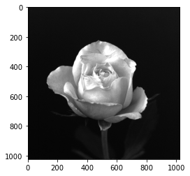
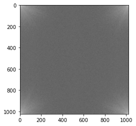
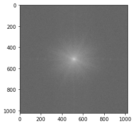
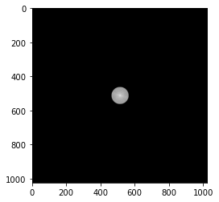
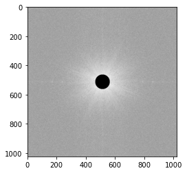
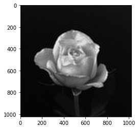
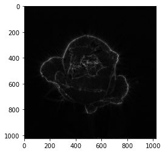

# Edge detection

Detail : https://jstar0525.tistory.com/59

## Input image
</img>

## FFT
</img>

## FFT shift
</img>

## filtering
### low-pass filter
</img>

### high-pass filter
</img>

## inverse FFT
### low-pass filter
</img>

### high-pass filter
</img>