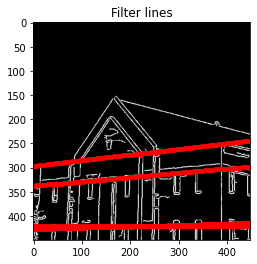

# Hough transform

Detail : https://jstar0525.tistory.com/66

# Simple Example
## Input image
</img>

## Hough space
</img>

## Select lines
</img>

# Example

## Input image
</img>

## Hough space
</img>

## Select lines
</img>
</img>

## filtering
</img>